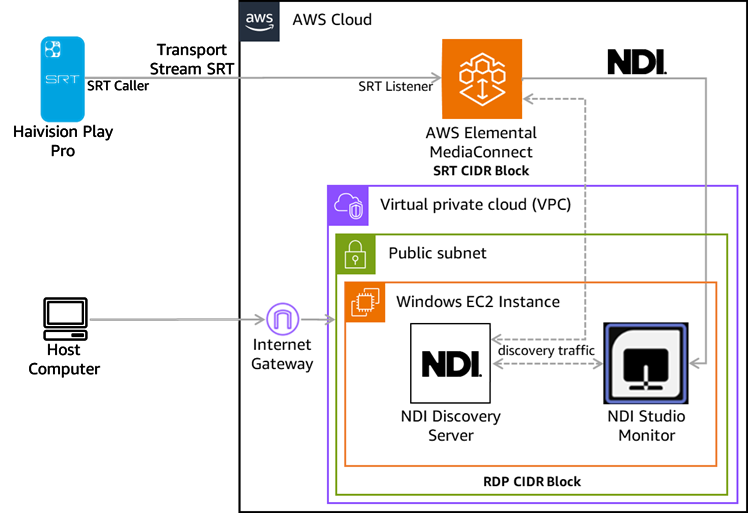
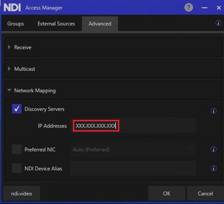

# Contribute Content to AWS using NDI with MediaConnect

<!--TOC-->

- [Contribute Content to AWS using NDI with MediaConnect](#contribute-content-to-aws-using-ndi-with-mediaconnect)
- [Disclaimer And Data Privacy Notice](#disclaimer-and-data-privacy-notice)
- [Introduction](#introduction)
- [The workflow](#the-workflow)
- [Prerequisites](#prerequisites)
- [The solution](#the-solution)
  - [Step 1. Create the AWS Cloud resources](#step-1-create-the-aws-cloud-resources)
  - [Step 2. Install NVIDIA driver on the Windows EC2 Instance](#step-2-install-nvidia-driver-on-the-windows-ec2-instance)
  - [Step 3. Install NDI Tools and launch the NDI Discovery Server](#step-3-install-ndi-tools-and-launch-the-ndi-discovery-server)
  - [Step 4. Configure NDI Discovery Server](#step-4-configure-ndi-discovery-server)
  - [Step 5. Install Haivision Play Pro and create SRT stream](#step-5-install-haivision-play-pro-and-create-srt-stream)
  - [Step 6. Start the MediaConnect flow (console)](#step-6-start-the-mediaconnect-flow-console)
  - [Step 7. Start NDI Tool’s Studio Monitor](#step-7-start-ndi-tools-studio-monitor)
- [Clean up](#clean-up)
- [Conclusion](#conclusion)
- [Further reading](#further-reading)
- [Security](#security)
- [License](#license)
- [Trademarks](#trademarks)

<!--TOC-->

# Disclaimer And Data Privacy Notice

When you deploy this solution, scripts will download different packages with different licenses from various sources. These sources are not controlled by the developer of this script. Additionally, this script can create a non-free and un-redistributable binary. By deploying and using this solution, you are fully aware of this.

# Introduction

The secure and reliable Ingest of live video content to the Amazon Web Services (AWS) Cloud over NDI® [(Network Device Interface)](https://ndi.video/tech/) has previously been a challenge for our customers. With the addition of NDI outputs in AWS Elemental MediaConnect [(MediaConnect)](https://docs.aws.amazon.com/mediaconnect), you can now directly ingest live video to AWS and convert it to NDI for use in a Virtual Private Cloud (VPC).

NDI is a high quality video connectivity technology that facilitates ultra-low latency video communication over internet protocol (IP). NDI is widely used in live production applications and supported by more than 500 hardware products and 300 software applications. Systems use NDI to encode, transmit, and receive multiple streams of video and audio in near real-time.

The new MediaConnect functionality to convert Secure Reliable Transport (SRT) or other compressed streams into NDI outputs provides an efficient solution for unifying traditional sources with modern, IP-based production tools. It can be used by broadcasters and live production teams who want to seamlessly integrate into their standards-based contribution workflows with the flexibility of NDI-based production environments.

We will build a demonstration of low-latency live video contribution to the AWS Cloud and conversion to NDI with MediaConnect. We will:

* Create an Amazon Virtual Private Cloud [Amazon VPC](https://aws.amazon.com/vpc/?nc2=type_a).
* Create a MediaConnect [flow](https://docs.aws.amazon.com/mediaconnect/latest/ug/flows.html) with an Amazon VPC output.
* Create a Windows Amazon Elastic Compute Cloud [(Amazon EC2) Instance](https://docs.aws.amazon.com/AWSEC2/latest/UserGuide/Instances.html) in the Amazon VPC, install NDI Tools and an NDI Discovery Server.
* Use [Haivision Play Pro](https://www.haivision.com/products/haivision-play-pro/) to stream video and audio data over SRT from a mobile device or PC to MediaConnect.
* Configure MediaConnect to receive the SRT stream and generate an NDI source from a MediaConnect output.
* Use NDI Tool’s Studio Monitor to receive and display the NDI stream.

AWS Elemental MediaConnect is a transport service that enables secure and reliable delivery of live video into, through, and out of the AWS Cloud. Using MediaConnect, you can send high-quality video to AWS for processing, storage, and distribution, with features including encryption, redundancy, and bandwidth-efficient protocols for reliable video transport.

The following diagram (Figure 1) shows how you can use the Haivision Play Pro player on a mobile device to stream content over SRT to a VPC in the AWS Cloud. MediaConnect converts the content to an NDI source. A Windows EC2 instance, in the Amazon VPC, running NDI Tools Discovery Server routes the NDI content to an NDI Tools Studio Monitor, which displays the NDI source.



*Figure 1: High-level architecture.*

# The workflow

The Haivision Play Pro application on a mobile device or PC serves as the SRT source that is sent over the internet to a MediaConnect flow. MediaConnect provides a public ingest endpoint for SRT contribution. A dedicated VPC interface delivers MediaConnect NDI output traffic privately into your VPC. Inside the VPC, a public subnet hosts a Windows EC2 instance running the NDI Discovery Server and NDI Studio Monitor applications. The NDI Studio Monitor receives and processes the NDI stream from MediaConnect. The Internet Gateway allows secure access to the EC2 instance from the internet. NDI traffic remains within the VPC environment, facilitating seamless integration with NDI-based production systems.

The AWS resources to enable this workflow are setup using [AWS CloudFormation](https://aws.amazon.com/cloudformation/) templates. AWS CloudFormation is an Infrastructure as Code (IaC) service. Templates let you model, provision, and manage AWS and third-party resources as code. For more information on using AWS CloudFormation templates read [Working with CloudFormation templates](https://docs.aws.amazon.com/AWSCloudFormation/latest/UserGuide/template-guide.html).

# Prerequisites

An AWS account must exist to create the AWS resources. The account must have the ability to create a GPU instance, which is not enabled by default. The workflow uses a four vCPU g4dn.xlarge instance, which requires a minimum service quota of four vCPUs for Running On-Demand G and VT instances. To check your quota, use the [EC2 Service Quota console](https://us-west-2.console.aws.amazon.com/servicequotas/home/services/ec2/quotas).

A mobile device or PC with access to the internet must be available to use as the SRT source.

Note, this workflow is for demonstration purposes. For production workflows, apply additional security measures (such as permissions and CIDR blocks) for your specific environment.

# The solution

## Step 1. Create the AWS Cloud resources

Deploy the AWS resources from a system that contains the [AWS Command Line (CLI) Tools](https://docs.aws.amazon.com/cli/latest/userguide/getting-started-install.html). Confirm the [AWS Account credentials and default region](https://docs.aws.amazon.com/cli/v1/userguide/cli-configure-files.html) are setup.

1. Download the [AWS CloudFormation templates and scripts](https://github.com/aws-samples/sample-MediaConnect-Contribute-Content-Ndi)
2. Create an Amazon Simple Storage Service [Amazon S3](https://aws.amazon.com/s3/) bucket in your AWS account to store the CloudFormation template files.
3. To create the AWS Cloud resources, create a CloudFormation stack using the following command (be certain to replace the values in this bulleted list accordingly):

* **\<S3_BUCKET_NAME>** The name of your S3 bucket.
* **\<S3_FOLDER>** The name of the folder to create within the S3 bucket.
* **\<STACK_NAME>** The name of the stack to create.
* **\<PREFIX>** The prefix for new AWS resource names.
* **\<RDP_CIDR_BLOCK>** The CIDR block for the IP range for remote desktop access to the EC2 instance.
* **\<SRT_CIDR_BLOCK>** The CIDR block for the IP range for SRT traffic to MediaConnect.
* **\<PORT>** The port to use for SRT traffic to MediaConnect.
* (Optional) **<IAM_PROFILE>** The AWS Identify and Access Management (IAM) profile to use instead of default AWS credentials. Default credentials require a region. Note, the `.aws/credentials` file must contain the profile and default region.

**Linux command:**

```
./create_stack.sh <S3_BUCKET_NAME> <S3_FOLDER> <STACK_NAME> <PREFIX> <RDP_CIDR_BLOCK> <SRT_CIDR_BLOCK> <PORT> <IAM_PROFILE>
```

**Windows PowerShell command:**

```
./create_stack.ps1 <S3_BUCKET_NAME> <S3_FOLDER> <STACK_NAME> <PREFIX> <RDP_CIDR_BLOCK> <SRT_CIDR_BLOCK> <PORT> <IAM_PROFILE>
```

4. If the process completes successfully, the script outputs the information shown below:

* **SourceIngestIp** is the IP address MediaConnect flow listens on. Note the value as a later section uses it to configure the Haivision Pro Player SRT source.
* **NdiMachineName** and **NdiProgramName** are the machine and program names of the NDI source. Note the values as Step 7 uses them to select the NDI source in NDI Tools Studio Monitor.
* **FlowArn** is the [Amazon Resource Name](https://docs.aws.amazon.com/mediaconnect/latest/ug/what-is-concepts.html) (ARN) of the MediaConnect flow.
* The name of the EC2 instance keypair’s `.pem` file written to your current folder. The next step uses the file.

## Step 2. Install NVIDIA driver on the Windows EC2 Instance

The NDI Studio Monitor application requires a GPU instance and a specific set of NVIDIA drivers. The CloudFormation template creates the GPU instance and downloads the NVIDIA driver installer application to the desktop. The application requires manual intervention to install the driver. Use the following to install the driver:

1. [Retrieve the Administrator password](https://docs.aws.amazon.com/AWSEC2/latest/UserGuide/connect-rdp.html#retrieve-initial-admin-password) for the instance using the `.pem`  file from Step 1, Point 4.
2. [Log in](https://docs.aws.amazon.com/AWSEC2/latest/WindowsGuide/connecting_to_windows_instance.html) to the instance.
3. Navigate to the desktop and double-click the **NVIDIA** folder.
4. Continue to double-click on subfolders, as in **windows -> latest**, until you locate the installation executable file. An example of the name:
`XXX.XX_Cloud_Gaming_win10_win11_server2022_dch_64bit_international.exe`
5. Double-click the file to launch it.
6. Follow the prompts to install.

## Step 3. Install NDI Tools and launch the NDI Discovery Server

NDI distributes a set of tools that are free to download and use.

1. Download and install [NDI Tools](https://ndi.video/tools/)
2. Launch the Discovery Server application from:

```
C:\Program Files\NDI\NDI 6 Tools\Discovery\NDI Discovery Service.exe
```

The server runs using a shell to display output.

***(Optional)*** To automatically launch the Discovery Server on system restarts, create a program shortcut and move it to:

```
C:\Users\Administrator\AppData\Roaming\Microsoft\Windows\Start Menu\Programs\Startup
```
## Step 4. Configure NDI Discovery Server

Use NDI Tool’s Access Manager to configure the Discovery Server IP address as shown in Figure 2, replacing `XXX.XXX.XXX.XXX` with the **Private IP** address of the Windows EC2 Instance. The Discovery Server is on the instance, optionally you can specify the **localhost** instead of the IP address.



*Figure 2: Set Discovery Server IP address using NDI Access Manager*

## Step 5. Install Haivision Play Pro and create SRT stream

1. Download and install the [Haivision Play Pro](https://www.haivision.com/products/haivision-play-pro/) application on a mobile device or PC.
2. Create an **SRT-caller** stream to send to the MediaConnect **Inbound IP address** and **Port** using the **SourceIngestIp** from Step 1, Point 4 and **\<PORT\>** from Step 1, Point 3.
3. Start the stream.

## Step 6. Start the MediaConnect flow (console)

1. Open the [AWS Elemental MediaConnect console](https://console.aws.amazon.com/mediaconnect/).
2. Select **the flow**, and choose **Start**.
3. After the flow starts, the stream from the Haivision Play Pro application is visible in the flow’s thumbnail preview window.

## Step 7. Start NDI Tool’s Studio Monitor

The NDI Tools Studio Monitor validates the NDI stream from the MediaConnect flow’s NDI output. Use the following to start the NDI Tools Studio Monitor:

1. [Log in](https://docs.aws.amazon.com/AWSEC2/latest/WindowsGuide/connecting_to_windows_instance.html) the Windows EC2 instance.
2. Launch **NDI Tools** from the desktop icon.
3. From the NDI Tools window, launch the **Studio Monitor**.
4. Hover the mouse over the Studio Monitor window. Near the upper left, select the **icon with the three horizontal bars**.
5. A popup menu shows the available sources. Choose the values for **NdiMachineName** then **NdiProgramName** (from Step 1, Point 4) to view the stream.

# Clean up

To prevent charges after evaluating this solution, stop the flow and delete all the AWS resources by using the following command (be certain to replace values in this bulleted list accordingly):

* **\<STACK_NAME>** The name of the stack to delete.
* (Optional) **<IAM_PROFILE>** The IAM Profile to use instead of default AWS credentials. Default credentials require a region. Note, the `.aws/credentials` file must contain the profile and default region.

**Linux command:**

```
./delete_stack.sh <STACK_NAME> <IAM_PROFILE>
```

**Windows PowerShell command:**

```
.\delete_stack.ps1 <STACK_NAME> <IAM_PROFILE>
```

Verify that all AWS Resources no longer exist by checking the AWS Console. This confirms no resources are accidentally left running, which leads to additional charges.

# Conclusion

We showed how you can use AWS Elemental MediaConnect to convert an SRT transport stream from the internet into an NDI source within an Amazon VPC. This facilitates communication between NDI enabled software within live cloud production workflows.

Contact an [AWS Representative](https://pages.awscloud.com/Media-and-Entertainment-Contact-Us.html) to know how we can help accelerate your business.

# Further reading

* [AWS Elemental MediaConnect adds support for NDI outputs](https://aws.amazon.com/about-aws/whats-new/2025/03/aws-elemental-mediaconnect-support-ndi-outputs/)
* [Guidance for Programmatic Deployment of NDI Discovery Servers for Broadcast Workflows on AWS](https://aws.amazon.com/solutions/guidance/programmatic-deployment-of-ndi-discovery-servers-for-broadcast-workflows-on-aws/)
* [Using NDI for video switching and routing in AWS](https://aws.amazon.com/blogs/media/using-ndi-for-video-switching-and-routing-in-aws-2/)
* [AWS supports the second multi-partner live cloud production interoperability workshop](https://aws.amazon.com/blogs/media/aws-supports-the-second-multi-partner-live-cloud-production-interoperability-workshop/)
* [NDI Docs & Guides](https://docs.ndi.video/all)

# Security

See [CONTRIBUTING](CONTRIBUTING.md#security-issue-notifications) for more information.

# License

This library is licensed under the MIT-0 License. See the LICENSE file.

# Trademarks

NDI® is a registered trademark of Vizrt NDI AB.
